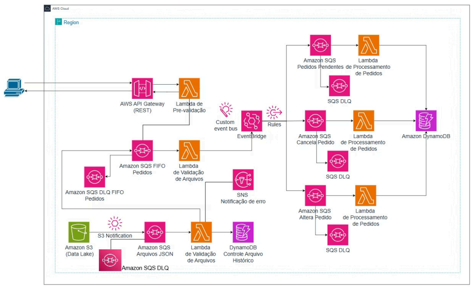

# Arquitetura de Processamento de Pedidos Serverless na AWS

Este repositório contém a documentação completa do projeto desenvolvido durante a "Semana do Desenvolvedor" da Escola da Nuvem. O objetivo foi construir uma arquitetura orientada a eventos, robusta e escalável para o processamento de pedidos de múltiplas fontes, utilizando serviços Serverless da AWS.

**Nota Importante:** Os recursos da AWS descritos nesta documentação foram criados num ambiente de laboratório partilhado e foram **excluídos** após a conclusão do projeto para evitar custos. Esta documentação serve como um registo detalhado da arquitetura e da implementação.

---

## Visão Geral do Projeto

A solução implementada é capaz de ingerir pedidos de duas formas distintas:
1.  **Em tempo real:** Através de um endpoint de API REST.
2.  **Em lote:** Através do upload de ficheiros JSON para um bucket S3.

O sistema processa, valida e persiste os dados de forma assíncrona e desacoplada, além de gerir operações do ciclo de vida do pedido, como alteração e cancelamento.

### Diagrama da Arquitetura Final

### Stack de Tecnologias

**Backend (AWS):**
- **Compute:** AWS Lambda
- **Integração:** Amazon API Gateway, Amazon SQS (Standard & FIFO), Amazon EventBridge, Amazon SNS
- **Armazenamento:** Amazon S3, Amazon DynamoDB
- **Gestão e Governança:** AWS IAM, Amazon CloudWatch

**Frontend:**
- **Hospedagem:** AWS Amplify (com CI/CD)
- **Código:** HTML5, CSS3, JavaScript (Vanilla JS, ES6+)

---

## Módulos do Projeto

### Módulo 1: Ingestão de Pedidos via API

Nesta fase, foi construído o fluxo principal para receber pedidos individuais em tempo real.

- **Objetivo:** Criar um endpoint de API que recebe dados de pedidos, os valida e os enfileira de forma segura e ordenada.
- **Fluxo:** `API Gateway -> Lambda (pré-validação) -> SQS FIFO -> Lambda (validação) -> EventBridge`
- **Recursos Criados:**
  - **IAM Roles:** `lambda-prevalidacao-role-thiago`, `lambda-validacao-pedidos-role-thiago`
  - **SQS FIFO:** `pedidos-fifo-queue-thiago.fifo` (DLQ: `pedidos-fifo-dlq-thiago.fifo`)
  - **Lambda Functions:** `pre-validacao-lambda-thiago`, `validacao-pedidos-lambda-thiago-stella-pontes`
  - **API Gateway:** `pedidos-api-thiago` com endpoint `POST /pedidos`
  - **EventBridge:** `pedidos-event-bus-thiago`

### Módulo 2: Ingestão de Ficheiros via S3

Nesta fase, foi adicionado um segundo canal de entrada para processar pedidos recebidos em lote.

- **Objetivo:** Configurar um pipeline que é acionado pelo upload de um ficheiro JSON num bucket S3, validando o ficheiro, extraindo os pedidos e integrando-os ao fluxo principal.
- **Fluxo:** `S3 Upload -> S3 Notification -> SQS Standard -> Lambda (validação de ficheiro) -> DynamoDB (histórico) / SNS (erros) / SQS FIFO (pedidos válidos)`
- **Recursos Criados:**
  - **IAM Role:** `lambda-s3-validation-role-thiago`
  - **S3 Bucket:** `datalake-arquivos-thiago`
  - **SQS Standard:** `s3-arquivos-json-queue-thiago` (DLQ: `s3-arquivos-json-dlq-thiago`)
  - **DynamoDB Table:** `controle-arquivos-historico-thiago`
  - **SNS Topic:** `notificacao-erro-arquivos-thiago`
  - **Lambda Function:** `validacao-s3-arquivos-lambda-thiago`

### Módulo 3: Processamento Central e Persistência

Esta fase conectou os fluxos de ingestão à lógica de negócio principal, processando os pedidos validados e guardando-os na base de dados.

- **Objetivo:** Consumir os eventos de `NovoPedidoValidado` do EventBridge, processar os pedidos e persistir o estado final numa tabela DynamoDB.
- **Fluxo:** `EventBridge Rule -> SQS Standard -> Lambda (processamento) -> DynamoDB`
- **Recursos Criados:**
  - **IAM Role:** `lambda-processa-pedidos-role-thiago`
  - **SQS Standard:** `pedidos-pendentes-queue-thiago` (DLQ: `pedidos-pendentes-dlq-thiago`)
  - **DynamoDB Table:** `pedidos-db-thiago` (Tabela principal)
  - **Lambda Function:** `processa-pedidos-lambda-thiago`
  - **EventBridge Rule:** `novo-pedido-validado-rule-thiago`

### Módulo 4: Ciclo de Vida do Pedido e Tratamento de Erros

A fase final do backend expandiu a funcionalidade para gerir o ciclo de vida completo do pedido e validar o funcionamento das DLQs.

- **Objetivo:** Implementar fluxos para alteração e cancelamento de pedidos, e testar na prática a resiliência do sistema com as Dead-Letter Queues.
- **Fluxo (Cancelamento/Alteração):** `EventBridge (evento manual) -> EventBridge Rule -> SQS Standard -> Lambda (alteração/cancelamento) -> DynamoDB (UpdateItem)`
- **Recursos Criados:**
  - **IAM Role:** `lambda-altera-cancela-role-thiago`
  - **SQS Standard (Cancelamento):** `cancela-pedido-queue-thiago` (DLQ: `cancela-pedido-dlq-thiago`)
  - **SQS Standard (Alteração):** `altera-pedido-queue-thiago` (DLQ: `altera-pedido-dlq-thiago`)
  - **Lambda Functions:** `cancela-pedido-lambda-thiago`, `altera-pedido-lambda-thiago`
  - **EventBridge Rules:** `cancela-pedido-rule-thiago`, `altera-pedido-rule-thiago`

### Módulo 5: Interface de Demonstração (Front-end)

Para materializar a arquitetura de backend, foi desenvolvida uma interface web estática para interagir com o sistema e demonstrar visualmente os fluxos de dados.

- **Objetivo:** Criar uma UI simples para submeter pedidos (via API e S3) e visualizar os resultados processados.
- **Fluxo e Funcionalidades:**
  1.  **Criação de Pedido (API):** Um formulário envia um novo pedido para o endpoint `POST /pedidos`.
  2.  **Criação em Lote (S3):** Um campo de upload utiliza **S3 Presigned URLs** (obtidas de um novo endpoint `POST /upload-url`) para enviar ficheiros JSON de forma segura para o S3.
  3.  **Visualização de Pedidos:** Um botão "Mostrar Pedidos" aciona uma chamada a um novo endpoint `GET /pedidos`, que busca os dados no DynamoDB e os exibe numa tabela ordenada por data.
- **Pontos Chave de Aprendizagem:**
  - **Integração Segura:** Implementação do padrão de S3 Presigned URLs.
  - **Resolução de CORS:** Configuração detalhada de CORS no API Gateway (para múltiplos endpoints) e no Bucket S3.
  - **Renderização Dinâmica:** Manipulação do DOM com JavaScript para exibir dados do backend.
  - **CI/CD com Amplify:** Automação do processo de deploy a cada `git push`.

---

## Conclusão

Este projeto foi uma jornada prática e intensiva através dos principais serviços serverless da AWS, focando não apenas na implementação, mas também na depuração de problemas reais de permissão e integração. O resultado é uma arquitetura completa, resiliente e escalável, que serve como uma peça de portfófolio sólida e demonstrável.